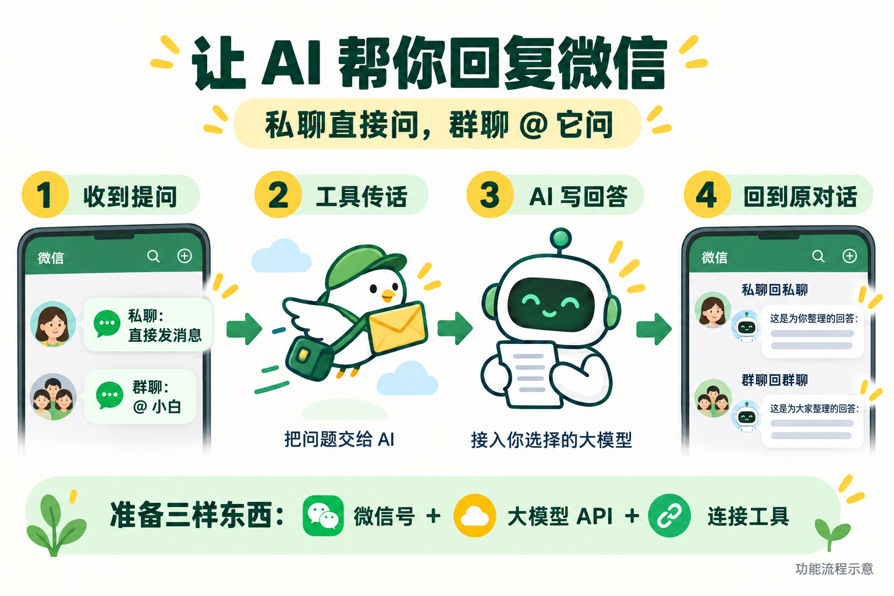
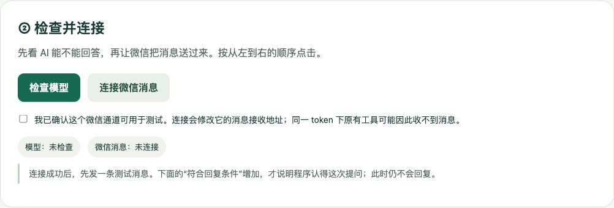
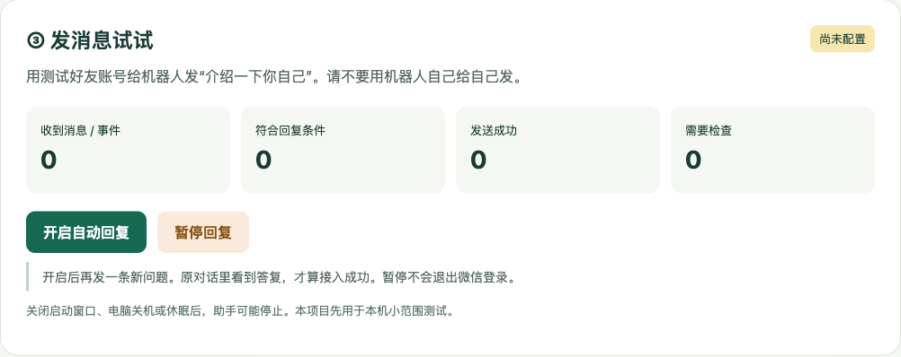

# AI 如何接入微信：从零跑通私聊与群聊回复

有人私信你，AI 可以先回答一个简单问题；群里有人 @ 助手，它也能接话。你不用让对方换一个软件，答案就出现在原来的微信对话里。

这篇教程带你亲手做出这样的助手。**先让一个测试好友收到回复，再扩展到群聊。**不要求会写代码，操作主要是安装、复制信息和点击中文按钮。

[下载配套文件](https://github.com/huangbai-AI/wechat-ai-starter/releases/latest) · [飞书图文版](https://hcnbsg6ttb3t.feishu.cn/docx/OMEtdUxb4o9PHkxwF3EcqNconRc) · [遇到问题](docs/常见问题.md)

> 本文完成的是“在自己的电脑上跑通文字收发”。电脑关机或休眠后，它就不能持续工作。长期在线、知识库、语音和图片理解，留到后续扩展。

## 先看这张图：消息走了一圈

*功能示意图，非真实聊天记录。*

把它想成三个人分工：**微信号负责接待，大模型负责思考，连接程序负责传话。**

例如，小明私信“小白”：“今天第一次做直播，先准备什么？”连接程序收到问题，交给大模型，再用小白这个微信号把回答发给小明。群聊也是同样的过程，只多了一条规则：在指定群里真正 @ 小白才回复。

这套项目提供了连接程序和中文面板。微信通道采用 **WechatApi**；大模型可以换成支持本项目聊天格式的服务商。**模型可以换，但微信通道不能随便填另一个平台的地址就当作兼容。**

## 开始前，把这四样东西准备好

| 你要准备什么 | 它是做什么的 | 这一步是否可能花钱 |
| --- | --- | --- |
| 一个用于助手的微信号、一个测试好友 | 一个回答，一个提问 | 取决于你已有的账号条件 |
| 可用的 WechatApi 服务账号与通道权限 | 让程序能收发微信消息 | 可能需要服务商的付费权限 |
| 一个大模型开放平台账号与可用 API 额度 | 让程序向模型提问 | 通常按调用计费 |
| 一台保持联网的 Mac 或 Windows 电脑 | 运行配套程序 | 本项目文件免费，电脑和网络自行准备 |

先确认通道权限和模型额度，再开始安装。**聊天网页会员、编程套餐，不一定允许给微信助手调用；以服务商写明的用途和额度为准。**本教程不代售账号，也不提供共享密钥。

这是一种借助第三方服务连接个人微信的方案，并非微信官方机器人功能。它不承诺账号永远在线或零风险。先使用自己有权使用的账号、小范围测试；让参与者知道消息会交给 AI 处理。[使用边界](docs/隐私与边界.md)

## 第一站：把配套程序打开

### 1. 下载并解压

打开[下载页](https://github.com/huangbai-AI/wechat-ai-starter/releases/latest)，在附件区找到 **wechat-ai-starter-v0.1.0.zip**，下载后解压。进入文件夹，应该看到 `start.py`、`启动Mac.command`、`启动Windows.bat`、`app` 和 `docs`。

不要只下载一个启动文件，也不要在压缩包里直接双击运行。

### 2. 安装两个小工具

**Python** 负责运行程序；**cloudflared** 负责给这台电脑临时开一条接收消息的通道。两个都只需要安装一次。

- Python：从 [Python 官网](https://www.python.org/downloads/)安装正式版，版本需为 3.10 或更新。Windows 安装时如出现“Add python.exe to PATH”请勾选；Mac 安装后再运行 Python 文件夹里的 `Install Certificates.command`。
- cloudflared：从 [Cloudflare 官方下载说明](https://developers.cloudflare.com/cloudflare-one/networks/connectors/cloudflare-tunnel/downloads/)找到对应系统版本。解压或下载后，在项目文件夹新建 `tools` 文件夹；Mac 将程序命名为 `cloudflared`，Windows 命名为 `cloudflared.exe`，放进去。

不确定下载哪一项，直接看[Mac / Windows 安装说明](docs/安装指南.md)，里面有文件夹示意和启动方法。

### 3. 双击启动

Mac 双击 `启动Mac.command`；Windows 双击 `启动Windows.bat`。会出现一个运行窗口，以及浏览器里的中文面板。**运行窗口先留着，后面它需要一直工作。**

浏览器没有自动打开，就在本机浏览器输入：`http://127.0.0.1:8818`。

**做到这里：看到“让 AI 帮你回复微信”的面板。**打不开先看[安装指南](docs/安装指南.md)，不需要重新登录微信。

## 第二站：让程序认得你的微信号

### 1. 先在微信接入后台登录

打开 [WechatApi 管理后台](https://newmanager.wechatapi.net/wechat)，先登录服务商后台账号。后台账号和微信账号是两回事。

在微信管理页按页面提示为助手账号获取二维码，用**准备当助手的微信号**扫码，并在手机上确认。等后台显示在线，保留这个终端。已经在线就复用，不要反复创建新终端。[平台登录与准备说明](https://post.wechatapi.net/doc-9407520)

从后台复制两样东西：

- **微信终端 appId**：当前助手登录对应的终端编号。
- **微信通道密钥**：在后台“访问控制”中取得的 token，相当于允许程序使用这个通道的通行证。

如果后台没有可用通道、不能取得这两项信息，需要先向服务商确认权限；配套程序不能替你开通。

### 2. 回到面板，按格子填

*配套程序的真实界面，未填写真实密钥。*

先选 **“先试私聊”**，助手昵称可以填“小白”。填入刚才的 appId 和微信通道密钥；**微信通道地址保持默认**，除非服务商明确给了你新的兼容地址。

接着点 **“读取机器人身份”**。程序会自动填入“机器人自己的 wxid”，并显示读取到的昵称。核对它确实是你准备当助手的账号。

这里的 wxid 是微信内部编号，**不是手机号，也不是个人主页上可以修改的微信号**。程序用它来分清谁是谁，你不必背下来。

### 3. 只允许一个测试好友来问

用另一个账号加小白为好友。展开 **“找不到好友或群 ID？从通讯录选择”**，点 **“查找好友”**，找到测试好友并点击名字。程序会把他的编号填进“允许回复的好友 wxid”。联系人多时可以翻页。

**填的是提问的好友，不是机器人自己。**点选不会立刻开始回复，还需要后面的保存和开启步骤。

读取失败时，可以从服务商后台的账号详情、联系人信息复制对应内部编号。找不到就先停在这一步，别拿昵称试填。[编号填写对照](docs/常见问题.md)

**做到这里：机器人身份已确认，允许回复名单里只有你选择的测试好友。**

## 第三站：给它接上“大脑”

去你选择的模型服务商开放平台，创建自己的 **API Key（密钥）**，确认该账号有可用于模型调用的余额或额度。在模型文档中找到“OpenAI 兼容聊天接口”。这是一种不同服务商都可能支持的接入格式，不代表必须购买 OpenAI 的模型。

面板里要填三项：

| 面板字段 | 用人话理解 | 从哪里复制 |
| --- | --- | --- |
| 大模型调用地址 | 去哪里找 AI | 该服务商文档中的 Base URL / 基础地址 |
| 模型名称 | 具体请哪位 AI 回答 | 该服务商提供的模型 ID，原样复制 |
| 大模型密钥 | 用谁的额度来提问 | 同一服务商、对应地域或项目下创建的 API Key |

例如，Kimi 中国站的基础地址是 `https://api.moonshot.cn/v1`；千问等服务商也提供兼容接口，但地址、密钥和模型名称要用它们自己的。**三项要配套，不能把甲家的地址和乙家的密钥拼起来。**[Kimi 接入说明](https://platform.kimi.com/docs/guide/kimi-k2-6-quickstart) · [千问兼容接口说明](https://help.aliyun.com/zh/model-studio/compatibility-of-openai-with-dashscope)

地址末尾不要再加 `/chat/completions`，程序会补上。某些模型还要求特殊参数，按[模型填写示例](docs/模型配置.md)设置；不确定时先选支持普通文字聊天的模型。只提供其他接入格式的模型，不能直接套用本项目。

点 **“保存信息”**。保存后密钥输入框会清空，这是为了不在屏幕上继续显示它；下方会提示“密钥已保存”。以后只改别的字段，密钥留空就会保留。

**做到这里：面板显示“检查模式 · 暂不回复”。此时保存了信息，还没有开始发消息。**

## 第四站：先检查，再接通

先点 **“检查模型”**。看到“模型：检查通过”，说明这组地址、密钥、模型名称能正常返回答复。检查本身会消耗少量模型额度。

然后确认这个微信通道可以用于本次测试，勾选面板提示，再点 **“连接微信消息”**。通常等待几十秒，程序会创建临时接收地址，并自动把地址交给微信服务商。

**这里会修改同一微信通道密钥下的消息接收地址。**如果这个通道正在被另一个机器人使用，请先安排切换，或使用独立通道；否则原工具可能收不到消息。[服务商的接收地址规则](https://post.wechatapi.net/api-434899145)

你不需要手工拼网址、复制整段程序或再扫码一次。看到“微信消息：已连接”，再往下走。如果临时通道在你的网络里连不上，这条本机路线暂时不能完成；先看[排错说明](docs/常见问题.md)，不要反复重登微信。

**做到这里：模型检查通过，微信消息已连接。还差最后一次实际收发。**

## 第五站：用两条消息，确认真的能用

### 第一条：先确认“听得到”

用刚才加入名单的**测试好友账号**，私信小白：“介绍一下你自己。”

回到面板，“收到消息 / 事件”和“符合回复条件”应该增加。**这一条暂时不会回复，这是检查阶段的正常表现。**

只有第一个数字增加，说明消息到了，但不符合你设置的对象或触发规则。先核对好友是否选对，不要急着开更多功能。

### 第二条：再确认“答得回去”

点击 **“开启自动回复”**，然后让测试好友**再发一条新消息**：“我第一次做直播，先准备什么？”

等小白在这个私聊窗口里回答，同时面板“发送成功”增加，才算完成。前面检查阶段的消息不会自动补发。

**最终验收：不是只看到一个绿色状态，而是真的在原聊天窗口看见 AI 的回复。**模型可能需要一些时间，先等本条处理完，别连续刷屏测试。

## 私聊通了，怎么开群聊？

把小白拉进一个测试群。在面板选择 **“私聊和群聊都开”**；只想用于群聊就选“先试群聊”。展开通讯录选择，点“查找群”，选择目标群。群没出现时，先在手机微信中把该群保存到通讯录，再读取。

群编号通常以 `@chatroom` 结尾，**不能填写群名称**。助手昵称填它在这个群里的实际昵称。

修改后点保存，再做一次：**检查模型 → 连接微信消息 → 发检查消息 → 开启自动回复 → 再发一条新消息。**

群里发消息时，输入 `@`，**从成员列表中选中小白**，再输入问题。仅手打“@小白”几个字可能不是真正的提醒，程序不会把它当作提问。

现在两种场景分别是：

| 场景 | 谁会触发 | 回复到哪里 |
| --- | --- | --- |
| 私聊 | 允许名单里的好友直接发文字 | 这个好友的私聊窗口 |
| 群聊 | 指定群里有人从成员列表 @ 助手并发文字 | 原来的群聊 |

未列入名单的私聊、未指定的群、群里没 @ 的闲聊，不会触发本项目调用模型。图片、语音、文件也不属于本版的处理范围。

## 让它说话像一个有性格的助手

展开“高级设置”，在“助手性格”中写你希望它如何说话。例如：

> 你叫小白，是这个账号的 AI 小助手，不是账号主人本人。说话简洁，有自己的判断，不用客服腔。能解释的直接解释，不知道就直说。不要编造主人的经历、报价、行程或承诺；只发最终答复，不发分析草稿。不必每句话附链接，有可靠资料且对方需要时再分享。

保存后按前面的流程重新检查和开启。昵称输入框主要用于识别群内称呼；想改它自我介绍的名字，也要在这段性格说明里写清楚。

本版按会话保留**最多 20 条问答消息**，一问一答算两条，约等于最近 10 轮。私聊之间、私聊与群之间分开；同一个群的合格问答共用这 20 条。它没有读取全部历史聊天，也不会自动知道账号主人的身份、主页或粉丝量。

本版为方便验收，默认不让模型自行沉默；对方明确发“请不要回复这条消息”时会停答该条。性格可以调整，但不保证模型永远不会说错话。

## 日常怎么用，怎么停？

- **临时不想回复**：点“暂停回复”。这不会退出微信登录；已经发出去的消息不能撤回。
- **继续使用**：如果程序与通道一直开着，可以重新点“开启自动回复”。缺少检查时，面板会提示你先完成哪一步。
- **电脑重启后**：重新双击启动文件，检查模型、连接微信、发一条检查消息，再开启。程序不会一启动就自动发旧消息。
- **换模型或改名单**：修改并保存，随后重新检查、连接和验收。保存修改会暂停回复并关闭本程序的旧临时通道。
- **关浏览器页面**：只要运行窗口仍在、电脑没休眠，后台程序还可以工作。关闭运行窗口、断网、关机或休眠，都会影响回复。
- **想让电脑关机也能回**：需要把接收和回复程序迁到长期在线的服务器，并配稳定地址。本版的临时网址不等于已经部署到云端。[临时通道的适用范围](https://developers.cloudflare.com/cloudflare-one/networks/connectors/cloudflare-tunnel/do-more-with-tunnels/trycloudflare/)

## 卡住时，先看哪个数字没动

| 看到的情况 | 先做这一件事 |
| --- | --- |
| 模型检查不通过 | 核对调用地址、密钥、模型名称是否来自同一服务商，账号是否有额度 |
| 微信已连接，但收到消息不增加 | 确认微信后台在线，并排查另一个工具是否覆盖了接收地址 |
| 收到消息增加，符合回复条件不增加 | 私聊查允许好友；群聊查群编号及是否真正 @ |
| 符合回复条件增加，但没有回复 | 确认已开启自动回复，然后再发一条新消息 |
| “需要检查”增加 | 先看微信里是否其实已经收到；发送结果不明时程序不会盲目重发 |
| 重启后又不回了 | 重新走检查、连接、检查消息、开启四步 |

详细原因、安装问题和恢复方法放在[常见问题](docs/常见问题.md)。提问求助时，描述停在哪一站、面板提示和数字变化；不要公开自己的密钥、接收地址或聊天记录。

## 配套文件在哪里？

[GitHub 项目主页](https://github.com/huangbai-AI/wechat-ai-starter)提供教程、中文面板、启动文件、配置示例、测试和配图；[下载包](https://github.com/huangbai-AI/wechat-ai-starter/releases/latest)适合直接解压使用。

- [安装指南](docs/安装指南.md)：Mac / Windows 下载、启动及文件位置。
- [模型配置](docs/模型配置.md)：不同服务商如何填，哪些参数不能照抄。
- [常见问题](docs/常见问题.md)：从症状找到下一步。
- [隐私与边界](docs/隐私与边界.md)：消息去哪里、哪些资料不能上传。
- [验证记录](docs/验证记录.md)：本版检查过什么，哪些需要你的账号实际验收。

**先完成一次真实的“收到问题 → 给出答案”，你就已经掌握了接入的主线。**之后再加知识库和长期在线服务，每次只增加一个功能，会更容易判断问题出在哪一步。
