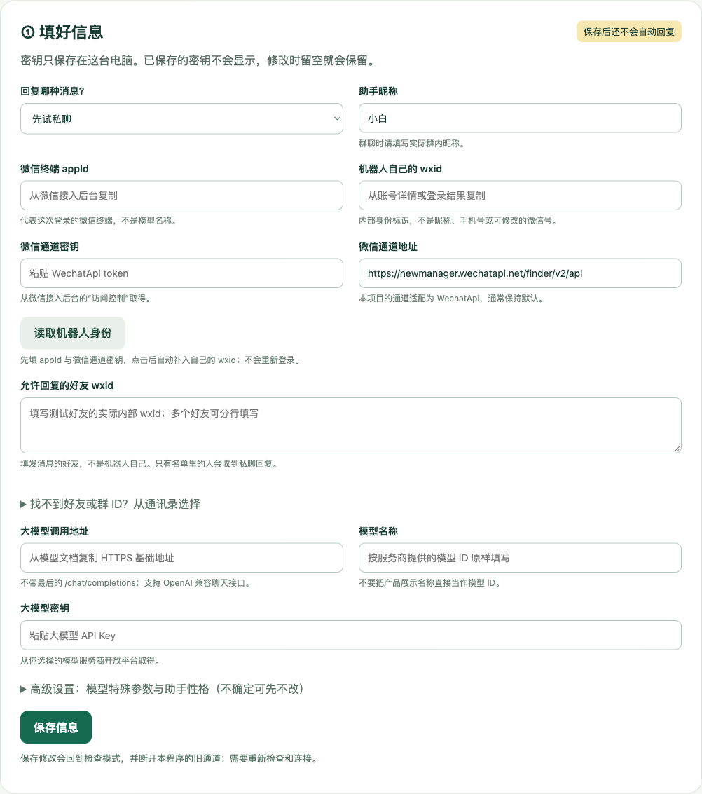

# 安装指南：先让面板出现在浏览器里

[返回主教程](../README.md)

## 一、拿到完整文件夹

1. 打开[下载页](https://github.com/huangbai-AI/wechat-ai-starter/releases/latest)。
2. 展开附件区（Assets），下载 `wechat-ai-starter-v0.1.0.zip`，不是单独下载启动文件。
3. 解压到容易找到的地方，例如“文稿”中的“微信AI助手”。不要放在需要多人共享的文件夹。

解压后应是下面这样。`tools` 是你在下一步新建的；`runtime` 是程序保存配置后自动生成的。

```text
微信AI助手/
├── 启动Mac.command
├── 启动Windows.bat
├── start.py
├── app/                 程序文件，不要拆开移动
├── docs/                教程和配图
├── tools/               你下载的连接工具放这里
│   └── cloudflared      Mac 名称；Windows 为 cloudflared.exe
└── runtime/             运行后产生：自己的密钥、问答记忆等，不要共享
```

源码也可在项目主页点绿色 Code → Download ZIP 下载；与发行包的主入口相同。

## 二、Mac 怎么装

### 安装 Python

打开 [Python 下载页](https://www.python.org/downloads/)，选择适合 macOS 的正式版安装包，版本为 3.10 或更新。跟随安装向导完成。

然后打开“应用程序”中的 `Python 3.x` 文件夹，双击 `Install Certificates.command`，等它完成。这一步让程序能正常验证远程服务身份；漏做可能出现网络连接失败。[官方 Mac 安装说明](https://docs.python.org/3/using/mac.html)

### 安装 cloudflared

如果已经用过 Homebrew，在终端执行 `brew install cloudflared` 即可。不熟悉它就走下面的下载路线，无需为了本文另外学习一套工具。

1. 点击苹果菜单 →“关于本机”。“芯片 Apple M…”选择 **arm64**；“处理器 Intel”选择 **amd64**。
2. 进入 [Cloudflare 官方下载页](https://developers.cloudflare.com/cloudflare-one/networks/connectors/cloudflare-tunnel/downloads/)，找到 macOS 部分，下载对应架构的程序压缩包。
3. 解压，找到 `cloudflared`。在项目文件夹新建 `tools`，把它放进去。

### 启动

双击 `启动Mac.command`。若下载解压后缺少执行权限：打开“终端”，输入 `cd `（末尾有空格），把整个项目文件夹拖入终端，按回车。再执行：

```sh
chmod +x 启动Mac.command tools/cloudflared
python3 start.py
```

如果通过 Homebrew 安装，第一行改为 `chmod +x 启动Mac.command`，因为 tools 里没有这个程序。

系统若提示安全拦截，先核对文件确实来自本项目及 Cloudflare 官方来源，再依系统提示处理；不要整体关闭系统安全保护。

## 三、Windows 怎么装

### 安装 Python

从 [Python 官网](https://www.python.org/downloads/)下载适合 Windows 的正式版，版本 3.10 或更新。运行安装程序；如果出现 **Add python.exe to PATH**，请勾选后安装。新版安装管理器若没有该选项，按其向导完成。

安装完成后再开一个新窗口，不要继续使用安装前已经打开的命令窗口。

### 安装 cloudflared

进入 [Cloudflare 官方下载页](https://developers.cloudflare.com/cloudflare-one/networks/connectors/cloudflare-tunnel/downloads/)，在 Windows 部分下载与你的电脑匹配的 EXE 程序，普通 64 位电脑选择 64 位版本。系统类型可在“设置 → 系统 → 关于”中查看。

在项目文件夹新建 `tools`，把下载的程序放进去，改名为 `cloudflared.exe`。

文件资源管理器里打开“文件扩展名”显示，确认不是 `cloudflared.exe.exe`。不要把安装器 MSI 直接改名成 EXE；这里需要的是可执行程序下载项。

### 启动

双击 `启动Windows.bat`，保留弹出的窗口。浏览器应该打开面板。

若没打开：在项目文件夹的资源管理器地址栏输入 `cmd` 并回车，在出现的窗口输入：

```bat
py -3 start.py
```

找不到 `py` 时可试 `python start.py`。两个都找不到，回到 Python 安装步骤；无需在网上下载来历不明的“修复包”。

## 四、成功标志

在当前电脑浏览器打开 `http://127.0.0.1:8818`，看到下面的中文面板，即可回[主教程第二站](../README.md)继续。这个地址只能供本机使用，手机或另一台电脑不能直接照抄打开。



如果提示端口已占用，先找是否已有一个本项目运行窗口，复用现有面板。不要为解决这个提示去停止其他微信程序。

程序只用 Python 自带功能，不需要额外安装 Python 扩展包。连接工具需单独从官方渠道取得，项目不打包第三方二进制程序。
